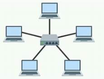
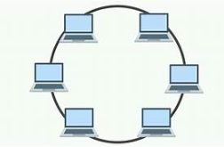
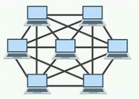
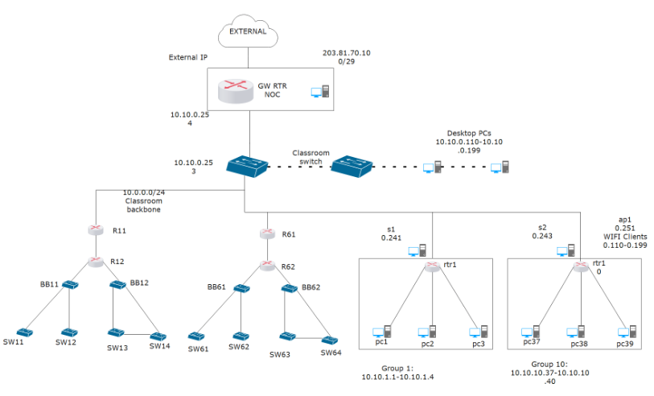
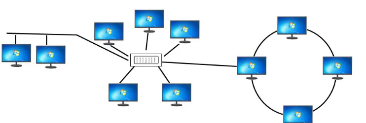

# Lecture 17 - Network Topologies

## Introduction

- Overview of network topologies.
- Importance of understanding network topologies.

## Features of Well-Known Network Topologies

### 1. Bus Topology

- **Description:** All devices share a single communication line or bus.
- **Diagram:**
  - Devices are connected to a central cable.
  - Data is transmitted in both directions.
  - A terminator is used at each end to prevent signal reflection.

#### Pros and Cons:

| Pros | Cons |
|------|------|
| Easy to implement | Difficult to troubleshoot |
| Less cable required | A break in the bus stops all communication |
| Cost-effective for small networks | Limited cable length and number of devices |

### 2. Star Topology

- **Description:** All devices are connected to a central hub.
- **Diagram:**
    - Devices are connected to a central hub or switch.
    - Data is transmitted through the hub.
    - Failure of one device does not affect others.

#### Pros and Cons

| Pros | Cons |
|------|------|
| Easy to add new devices | Expensive due to the central hub |
| Centralized management | Hub represents a single point of failure |
| Failure of one device does not affect others | More cable required than bus topology |

### 3. Ring Topology

- **Description:** Devices are connected in a circular fashion.
- **Diagram:**
    - Each device is connected to two other devices.
    - Data packets travel in one direction around the ring.
    - A break in the ring can disable the network.

#### Pros and Cons

| Pros | Cons |
|------|------|
| Data packets travel at high speed | A break in the ring can disable the network |
| No collisions | More difficult to configure and troubleshoot |
| Suitable for large networks | Limited scalability |

### 4. Mesh Topology

- **Description:** Each device is connected to every other device.
- **Diagram:**

#### Pros and Cons

| Pros | Cons |
|------|------|
| Highly reliable | Expensive due to high cabling cost |
| No single point of failure | Complex to install and configure |
| Data can be transmitted simultaneously | Maintenance can be challenging |

## Logical Network Topology

- **Description:** The arrangement of network devices and how data is transmitted logically through the network.
- **Examples:**
  - Logical Bus Topology
  - Logical Ring Topology

- **Diagram:**
  - Logical Bus Topology: Devices are connected to a central bus virtually.
  - Logical Ring Topology: Devices are connected in a ring virtually.

reference: <https://www.edrawsoft.com/logical-network.html>

## Hybrid Network Topology

- **Description:** Combination of two or more network topologies.

- **Examples:**
  - Bus-Star-Ring Topology
  

- **Diagram:**

    - Bus-Star-Ring Topology: Star Central hub connects to a bus and a ring.

 
reference: <https://theinstrumentguru.com/hybrid-topology-what-is-hybrid-topology/>

other:     

    - Star-Bus Topology: Devices are connected to a central hub, and the hub is connected to a bus.

    - Star-Ring Topology: Devices are connected to a central hub, and the hub is connected to a ring.

## Evaluation of Network Topologies

### Security Implications

- **Bus Topology:** Vulnerable to data collisions and security breaches as all devices share the same communication line.
- **Star Topology:** More secure as devices connect to a central hub, allowing for better control and monitoring.
- **Ring Topology:** Data can be intercepted easily if physical access to the ring is obtained.
- **Mesh Topology:** Highly secure as it supports multiple paths for data transmission, reducing the risk of interception.

### Implementation Considerations at the Organizational Level

- **Scalability:** How easily can new devices be added?
- **Cost:** What are the costs associated with implementing and maintaining the topology?
- **Maintenance:** How easy is it to troubleshoot and maintain the network?
- **Performance:** Does the topology support the required speed and reliability?

## References

1. Gale, A. (2024). Lecture 17 Network Topologies [PowerPoint slides].Retrieved from [URL](https://teams.microsoft.com/)