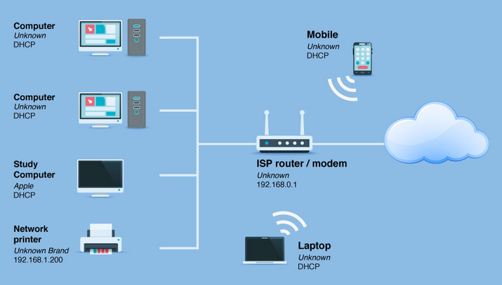
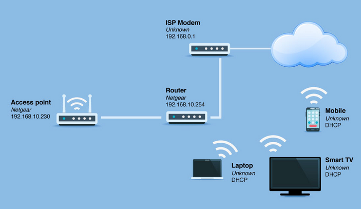

# Lecture 18_2 - Computer Network Diagrams

## Introduction to Computer Networks

- **Definition**: A computer network is a collection of interconnected devices that communicate with each other to share resources and information.
- **Types of Networks**:
  - **Local Area Network (LAN)**: Covers a small geographic area, like an office or home.
  - **Wide Area Network (WAN)**: Spans a large geographic area, often composed of multiple LANs.
  - **Metropolitan Area Network (MAN)**: Covers a city or a large campus.
  - **Personal Area Network (PAN)**: Connects personal devices within a short range.
- **Purpose and Importance**:
  - **Resource Sharing**: Allows multiple devices to share hardware, software, and data.
  - **Communication**: Facilitates communication through emails, instant messaging, and video conferencing.
  - **Data Management**: Centralizes data storage and management for easier access and security.
  - **Cost Efficiency**: Reduces costs by sharing resources and infrastructure.
- **Network Topologies**:
  - **Star Topology**: All devices are connected to a central hub.
  - **Bus Topology**: All devices are connected to a single central cable.
  - **Ring Topology**: Devices are connected in a circular chain.
  - **Mesh Topology**: Each device is connected to every other device.
- **Network Diagram Overview**:
  - Visual representation of a network’s structure and components.
  - Helps in planning, managing, and troubleshooting networks.

## Network Components

- **Switch**
  - **Function**: Connects devices within a local network.
  - **Features**: 
    - Operates at the data link layer (Layer 2)
    - Uses MAC addresses to forward data
    - Can be managed or unmanaged
  - **Security Implications**: 
    - VLANs can segment network traffic to reduce attack surfaces.
    - Managed switches offer security features like port security and access control lists (ACLs).

- **Router**
  - **Function**: Connects different networks and routes data between them.
  - **Features**:
    - Operates at the network layer (Layer 3)
    - Uses IP addresses to forward data
    - Can perform NAT and DHCP functions
  - **Security Implications**:
    - Implementing ACLs to filter traffic
    - Using firewalls to block malicious traffic
    - Enabling secure remote management features

- **Bridge**
  - **Function**: Connects two or more network segments.
  - **Features**:
    - Operates at the data link layer (Layer 2)
    - Filters traffic based on MAC addresses
  - **Security Implications**:
    - Helps reduce collision domains
    - Can prevent broadcast storms with proper configuration

- **Repeater**
  - **Function**: Amplifies and retransmits signals to extend the range of a network.
  - **Features**:
    - Operates at the physical layer (Layer 1)
    - Boosts signal without filtering or intelligent processing
  - **Security Implications**:
    - Limited as it doesn't perform intelligent traffic filtering or security functions
    - Ensures signals aren't easily intercepted due to weakened strength

- **Wireless Access Point (WAP)**
  - **Function**: Allows wireless devices to connect to a wired network.
  - **Features**:
    - Operates at the data link layer (Layer 2)
    - Uses Wi-Fi standards like 802.11a/b/g/n/ac/ax
  - **Security Implications**:
    - Implement WPA3 encryption to protect data
    - Use MAC filtering to control device access
    - Disable SSID broadcasting to obscure network presence

- **Server**
  - **Function**: Provides resources and services to clients on the network.
  - **Features**:
    - Can run various roles like file, web, or application server
    - Manages data, applications, and network resources
  - **Security Implications**:
    - Regularly update and patch server software
    - Implement role-based access controls (RBAC)
    - Use firewalls and intrusion detection/prevention systems (IDS/IPS)

## Network Diagrams

- **Example Diagram 1: Basic Home Network**
  
  - Components: Router, Switch, Wireless Access Point, Devices (e.g., PCs, Printers)

- **Example Diagram 2: Small Office Network**
  
  - Components: Router, Switches, Wireless Access Points, Servers, Clients, Printer

## Conclusion

- **Recap of Key Points**:
  - Networks enable resource sharing, communication, and efficient data management.
  - Different components such as switches, routers, bridges, repeaters, wireless access points, and servers each play a crucial role.
  - Security implications of each component are vital to maintain the integrity and confidentiality of the network.

- **Importance of Securing Each Component**:
  - Ensuring that each component is secured properly helps protect against cyber threats and data breaches.
  - Regular updates and proper configuration are essential in maintaining network security.

- **Q&A Session**:
  - see worksheets

## Additional Resources

- Cisco Packet Tracer (great network simulation tool for practice - including network and topology design)

## References

1. Gale, A. (2024). Lecture 18_2_Network Components [PowerPoint slides].Retrieved from [URL](https://teams.microsoft.com/)