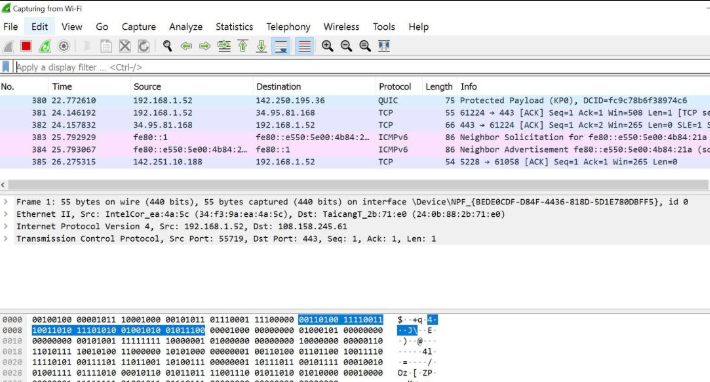

# Networks - External Storage Devices and Software

## Introduction

In today's world, technology is an integral part of our lives, and understanding how networks, storage devices, and software work is essential.

Throughout this session, we'll explore various topics related to external storage devices, operating systems, network monitoring, and application software. By the end of this lecture, you'll have a comprehensive understanding of these concepts and their significance.

## 1. External Storage Devices

**Definition**: Devices used to store data externally, outside the main computer.

- **Examples**: USB drives, external hard drives, SSDs, SD cards, network-attached storage (NAS) devices.
- **Uses**: Data backup, portability, expanding storage capacity, data sharing.
- **Vulnerabilities**:
  - Physical damage: Drops, water damage, wear and tear.
  - Data theft/loss: Misplacement, theft, loss of device.
  - Malware: Viruses, ransomware.
- **Protection Measures**:
  - Physical protection: Use protective cases, avoid extreme conditions.
  - Encryption: Encrypt data to prevent unauthorized access.
  - Regular backups: Use multiple backup locations.

## 2. Device Operating Systems

**Definition**: Software that manages hardware and software resources on devices.

- **Types**:
  - **Desktop Operating Systems**: Windows, macOS, Linux.
    - **Role**: Manage computer resources, provide user interface, run applications.
    - **Vulnerabilities**:
      - Malware attacks: Viruses, spyware, adware.
      - System crashes: Hardware failures, software bugs.
      - Unauthorized access: Hacking, phishing.
    - **Protection Measures**:
      - Install antivirus software.
      - Regular updates and patches.
      - Strong passwords and user authentication.
  - **Mobile Operating Systems**: iOS, Android.
    - **Role**: Manage mobile device resources, run mobile applications, provide user interface.
    - **Vulnerabilities**:
      - Malware: Mobile-specific viruses, spyware.
      - Data breaches: Unauthorized access to personal information.
    - **Protection Measures**:
      - Use mobile security apps.
      - Update operating system regularly.
      - Enable device encryption and remote wipe features.

## 3. Network Operating Systems

**Definition**: Software designed to manage network resources and provide services to multiple users.

- **Examples**: Windows Server, Linux (various distributions), Unix.
- **Roles**:
  - Manage network resources: File sharing, print services.
  - Security: User authentication, access control.
  - Communication: Email services, messaging.
- **Vulnerabilities**:
  - Network attacks: DDoS, man-in-the-middle attacks.
  - Data breaches: Unauthorized access to network data.
  - Service interruptions: Hardware failures, software issues.
- **Protection Measures**:
  - Use firewalls and intrusion detection systems (IDS).
  - Regular updates and security patches.
  - Implement strong access controls and user authentication.

## 4. Network Monitoring, Management & Troubleshooting Tools

**Definition**: Tools used to monitor, manage, and troubleshoot network performance and security.

- **Performance Monitors**:
  - **Function**: Monitor network performance metrics (e.g., bandwidth usage, latency).
  - **Example**: SolarWinds Network Performance Monitor.
  - **Vulnerabilities**:
    - False positives: Misinterpretation of data.
    - System overload: High resource consumption.
  - **Protection Measures**:
    - Regularly update monitoring software.
    - Use reliable and accurate monitoring tools.
- **Event Viewers**:
  - **Function**: Log and analyze events on a network (e.g., security incidents, system errors).
  - **Example**: Windows Event Viewer.
  - **Vulnerabilities**:
    - Log tampering: Unauthorized alteration of event logs.
    - Information overload: Too much data to analyze.
  - **Protection Measures**:
    - Secure log files and restrict access.
    - Use automated log analysis tools.
- **Vulnerability Scanners**:
  - **Function**: Scan network for security vulnerabilities.
  - **Example**: Nessus.
  - **Vulnerabilities**:
    - False positives/negatives: Incorrect vulnerability detection.
    - Exploitation: Scanners themselves can be exploited.
  - **Protection Measures**:
    - Regularly update scanner definitions.
    - Use multiple scanning tools for verification.
- **Packet Sniffers**:
  - **Function**: Capture and analyze network traffic.
  - **Example**: Wireshark.
  - **Vulnerabilities**:
    - Unauthorized access: Sniffers capturing sensitive data.
    - Data privacy issues: Exposure of private information.
  - **Protection Measures**:
    - Secure sniffer access and restrict usage.
    - Encrypt sensitive data on the network.

## 5. Network Application Software

**Definition**: Software applications that operate over a network.

- **Database Applications**:
  - **Function**: Manage and manipulate data stored in databases.
  - **Examples**: MySQL, Oracle Database.
  - **Vulnerabilities**:
    - SQL injection attacks.
    - Data breaches.
  - **Protection Measures**:
    - Use parameterized queries.
    - Implement strong database security measures.
- **Document Management Systems**:
  - **Function**: Store, manage, and track electronic documents.
  - **Examples**: Microsoft SharePoint, Google Drive.
  - **Vulnerabilities**:
    - Unauthorized access to documents.
    - Data loss.
  - **Protection Measures**:
    - Implement access controls and permissions.
    - Regular backups of documents.
- **Network Discovery Tools**:
  - **Function**: Identify and map devices on a network.
  - **Examples**: Nmap, Advanced IP Scanner.
  - **Vulnerabilities**:
    - Unauthorized network mapping.
    - Exposure of network structure.
  - **Protection Measures**:
    - Secure tool access and restrict usage.
    - Monitor network for unauthorized scans.

## Conclusion

In summary, this lecture content and the corresponding slide deck for this lecture will help you to: 

* Explain the use and vulnerabilities of external storage devices
* List the roles of operating system
* Explain why we need network monitoring and the tools we would use
* List network application software