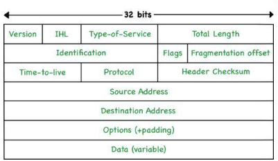
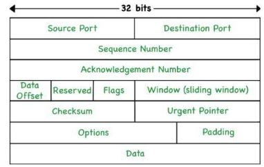
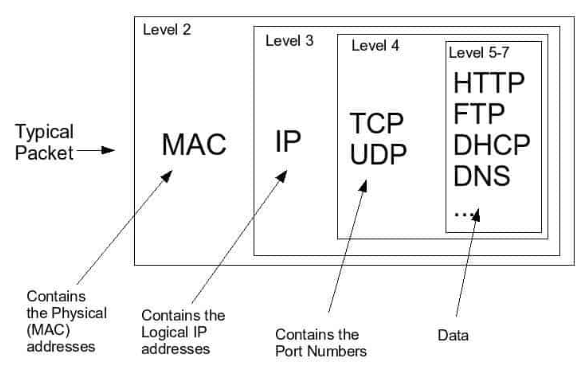

# Lesson 21: Network Transmission

## Network Transmission Lecture for Cybersecurity

### 1. TCP/IP Suite

**Introduction to TCP/IP:**

- **TCP/IP (Transmission Control Protocol/Internet Protocol)** is a suite of communication protocols used to interconnect network devices on the internet.
- **Layers of TCP/IP:**
  - **Application Layer**: Interfaces with user applications.
  - **Transport Layer**: Manages end-to-end communication.
  - **Internet Layer**: Handles packet routing.
  - **Network Access Layer**: Manages physical network connections.

**TCP (Transmission Control Protocol):**

- **Functionality:**
  - Ensures reliable, ordered, and error-checked delivery of data between applications.
  - Establishes a connection before data transmission (connection-oriented).
- **How it Works:**
  - Uses a three-way handshake to establish a connection.
  - Segments data and ensures it reaches its destination correctly.
- **Strengths:**
  - Reliable data transfer.
  - Error detection and recovery.
- **Weaknesses:**
  - Overhead from connection management.
  - Slower due to error checking.
- **Cybersecurity Implications:**
  - Vulnerable to SYN flood attacks.
  - Ensuring secure transmission channels (e.g., through encryption).

**IP (Internet Protocol):**

- **Functionality:**
  - Routes packets across network boundaries.
  - Provides addressing through IP addresses.
- **How it Works:**
  - Breaks data into packets.
  - Each packet is routed independently.
- **Strengths:**
  - Efficient packet routing.
  - Scalability across different network types.
- **Weaknesses:**
  - No guarantee of packet delivery.
  - Susceptible to IP spoofing.
- **Cybersecurity Implications:**
  - Vulnerabilities in IP routing can be exploited.
  - IPsec (Internet Protocol Security) can enhance security.

**Sending and Receiving Data:**

- Data is segmented into TCP segments, which are encapsulated in IP packets.
- **Example:**
  - **Sending**: An email client sends data through the TCP/IP stack.
  - **Receiving**: The server receives and processes the TCP segments.

Figure 1: IP Packet

reference: <https://www.geeksforgeeks.org/tcp-ip-packet-format/>

Typical IP Packet format fields:

- **Version:** IP version (IPv4 or IPv6).
- **Header Length:** Length of the IP header.
- **Type of Service:** Quality of service settings.
- **Total Length:** Total length of the IP packet.
- **Identification:** Unique identifier for the packet.
- **Flags:** Control information (e.g., fragmentation).
- **Fragment Offset:** Position of the fragment in the original packet.
- **Time to Live:** Maximum number of hops before discarding.
- **Protocol:** Transport layer protocol (e.g., TCP, UDP).
- **Header Checksum:** Error-checking data.
- **Source IP Address:** Sender's IP address.
- **Destination IP Address:** Receiver's IP address.
- **Options:** Additional settings.
- **Data:** The actual data being transmitted.

#### 2. Network Ports

**Common Network Ports and Their Uses:**

| **Port Number** | **Protocol** | **Use Case**                                    | **Cybersecurity Implications**           |
|-----------------|--------------|------------------------------------------------|-----------------------------------------|
| 21              | FTP          | File Transfer Protocol                         | Vulnerable to interception and attacks  |
| 22              | SSH          | Secure Shell for secure logins                 | Strong encryption, requires proper management |
| 25              | SMTP         | Simple Mail Transfer Protocol (Email sending)  | Spam and phishing risks                  |
| 80              | HTTP         | HyperText Transfer Protocol (Web browsing)     | Data can be intercepted (unencrypted)   |
| 443             | HTTPS        | Secure HTTP (encrypted web browsing)           | Ensures encrypted communication         |
| 53              | DNS          | Domain Name System (resolves domain names)     | DNS spoofing and cache poisoning        |

#### 3. Network Packets

**What are Network Packets?**

- Small units of data formatted for transmission across networks.

**Components of Network Packets:**

| **Component** | **Description**                                 |
|---------------|-------------------------------------------------|
| Header        | Contains metadata (source, destination, protocol) |
| Payload       | Actual data being transported                    |
| Trailer       | Optional, used for error checking and signaling  |

**TCP Packet Example:**

| **Field**            | **Description**                                        |
|----------------------|--------------------------------------------------------|
| Source Port          | Sender's port number                                   |
| Destination Port     | Receiver's port number                                 |
| Sequence Number      | Order of the packet                                    |
| Acknowledgment Number| Confirmation of received packets                       |
| Data Offset          | Size of the TCP header                                 |
| Flags                | Control information (e.g., SYN, ACK)                   |
| Window Size          | Flow control information                               |
| Checksum             | Error-checking data                                    |
| Urgent Pointer       | Priority data indicator                                |
| Options              | Additional settings                                    |
| Data                 | The actual data being transmitted                      |

Figure 2: TCP Packet

reference: <https://www.geeksforgeeks.org/tcp-ip-packet-format/>

**Motivation for Using Packets:**

- **Efficiency:** Smaller packets can be transmitted more efficiently.
- **Error Detection:** Easier to detect and correct errors in smaller packets.
- **Reliability:** Lost packets can be retransmitted without affecting the whole message.

Figure 3: Network Packet

reference: <https://networkencyclopedia.com/network-packet/>

#### 4. Significant Network Protocols

**HTTP/HTTPS (HyperText Transfer Protocol/Secure):**

- **Functionality:**
  - HTTP: Transmits web pages.
  - HTTPS: Securely transmits web pages.
- **Strengths:**
  - HTTP: Simplicity and speed.
  - HTTPS: Encryption ensures security.
- **Weaknesses:**
  - HTTP: Susceptible to interception.
  - HTTPS: Requires more resources.
- **Cybersecurity Implications:**
  - HTTPS is essential for secure web transactions.

**FTP (File Transfer Protocol):**

- **Functionality:** Transfers files between client and server.
- **Strengths:**
  - Efficient for large file transfers.
- **Weaknesses:**
  - Unencrypted, vulnerable to interception.
- **Cybersecurity Implications:**
  - Use SFTP (Secure FTP) to encrypt data.

**SMTP (Simple Mail Transfer Protocol):**

- **Functionality:** Sends emails.
- **Strengths:**
  - Widely supported.
- **Weaknesses:**
  - Susceptible to spam and phishing.
- **Cybersecurity Implications:**
  - Use authentication and encryption to secure email.

### Summary

By the end of this lecture, students should be able to:

- Discuss the 4 layers of the TCP/IP suite.
- Explain what data packets are and how they are transmitted across a network.
- Identify the most common network ports and their associated application types.

This content covers essential concepts of network transmission and related implications for cybersecurity.
