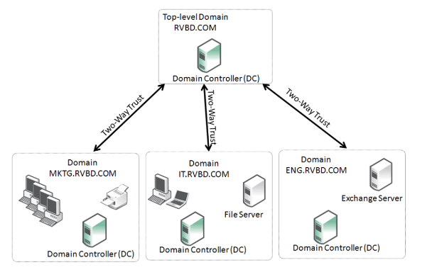
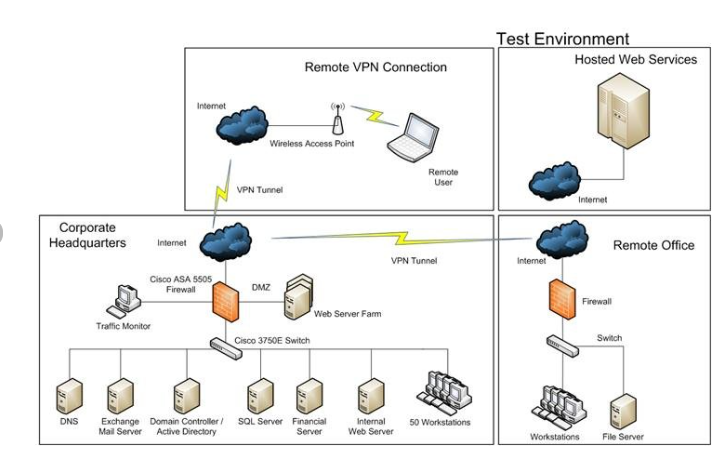
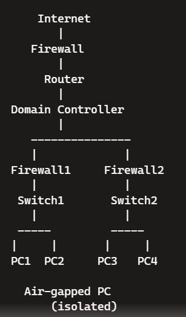
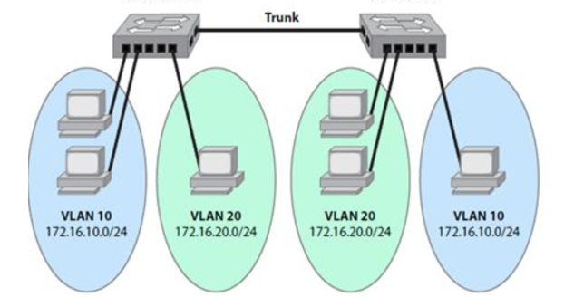

# Lecture 22: Network Structure

## Introduction

As networks become more complex and interconnected, safeguarding them becomes increasingly challenging. This session covers key topics in network structure and security.

### 1. Network Address Translation (NAT)

- **Definition**: NAT is a method used in IP networking to modify network address information in the IP header of packets while they are in transit across a traffic routing device.
- **Functionality**: Allows a single public IP address to be used by multiple devices within a private network.
- **Security Implications**: Provides a layer of security by masking internal IP addresses, making it harder for external entities to directly target internal devices.
- **Example**: A home router translates private IP addresses (e.g., 192.168.1.2) to a public IP address (e.g., 203.0.113.5) for internet access.

### 2. IP Addresses

- **Definition**: Unique identifiers for devices on a network, allowing them to communicate with each other.
- **Public IP Addresses**: Addresses assigned by ISPs for use on the internet. 
  - *Example*: 198.51.100.1
- **Private IP Addresses**: Addresses used within private networks, not routable on the internet.
  - *Example*: 192.168.0.1
- **Public Gateway IP Addresses**: Public-facing IP addresses for gateways providing internet access to a private network.
  - *Example*: A company's gateway IP assigned by their ISP.
- **Relationship with NAT**: NAT bridges private and public IP addresses, enabling private devices to access public networks without needing unique public IPs.

### 3. IPv4

- **Definition**: The fourth version of the Internet Protocol, providing an addressing capability of about 4.3 billion addresses.
- **Functionality**: Utilizes 32-bit addresses, typically represented in dotted decimal format (e.g., 192.0.2.1).
- **Security Implications**: Limited address space can lead to address exhaustion and security vulnerabilities. IPv4 can be augmented with security protocols like IPsec.

### 4. IPv6

- **Definition**: The sixth version of the Internet Protocol, designed to address IPv4 exhaustion with a vastly larger address space.
- **Functionality**: Utilizes 128-bit addresses, represented in hexadecimal (e.g., 2001:0db8:85a3:0000:0000:8a2e:0370:7334).
- **Security Implications**: Includes built-in security features such as IPsec. Larger address space significantly reduces the risk of address spoofing.

### 5. Network Domains

- **Definition**: Logical groupings of network resources that share a common directory database.
- **Domain Controllers**: Servers managing domain security policies and user authentication.
- **Authentication**: Verifies user identities to grant access to network resources.
- **Account Policies**: Define rules for password complexity, lockout thresholds, and account management.
- **User Restrictions**: Limit user permissions based on roles and responsibilities.
- **Network Operating Systems (NOS)**: Software that facilitates the setup, configuration, and management of network domains.
  - *Examples*: Windows Server, Linux.

Figure 1: Domain Controller

Multiple domains with two way trust structure.

Reference:

<https://support.riverbed.com/bin/support/static/u0hl9kshm7059oq1eromr6sd75/html/49flk91i6pcrupl971sgtgfrc/sh_9.7_dg_protocols_html/index.html#page/sh_9.7_dg_protocols/smb.html>

### 6. Network Subdomains

- **Definition**: Subdivisions of larger network domains, often used to organize resources and users based on function or location.
- **Functionality**: Enhances manageability and security by logically segmenting the network.
- **Security Implications**: Provides granular control over access and policy enforcement.

### 7. Network Segmentation

- **Definition**: The practice of dividing a network into smaller, isolated segments.
- **Physical Network Segmentation**: Uses physical devices like switches and routers to create distinct network segments.
- **Logical Networks (e.g., VLANs)**: Uses software configurations to segment networks virtually.
- **Air Gaps**: Complete physical separation of networks to prevent direct communication.
- **Pros/Cons**:
  - *Pros*: Improves security by isolating sensitive data, reduces attack surface, limits the spread of malware.
  - *Cons*: Increased complexity, higher costs for setup and maintenance.

Figure 2: Network Segmentation, Physical

Reference:

<https://www.researchgate.net/figure/shows-an-example-of-the-network-diagram-configuration_fig1_255248242>

Figure 3: Network Segmentation, Physical

Figure 4: Network Segmentation, Logical

Reference:

<https://www.linkedin.com/pulse/why-do-we-separate-networks-using-vlan-mohsen-hayati/>

### Summary Table

| Topic                    | Description                                                     | Security Benefits                              | Security Risks                                   |
|--------------------------|-----------------------------------------------------------------|------------------------------------------------|------------------------------------------------|
| **Network Address Translation (NAT)** | Translates private IPs to a public IP for internet access | Masks internal IP addresses                   | Potential for misconfiguration                   |
| **IP Addresses**          | Identifiers for network devices                                | Enables communication and routing             | IP spoofing, exhaustion of IPv4 addresses        |
| **IPv4**                  | Fourth version of Internet Protocol                           | Widely used, well understood                   | Limited address space, easier to spoof           |
| **IPv6**                  | Sixth version of Internet Protocol                            | Large address space, built-in security        | Complexity in transition from IPv4              |
| **Network Domains**       | Logical groupings of network resources                         | Centralized management, enforced policies     | Potential single points of failure               |
| **Network Subdomains**    | Subdivisions of network domains                               | Granular access control, manageability        | Can become complex to manage                     |
| **Network Segmentation**  | Dividing a network into isolated segments                      | Limits malware spread, reduces attack surface | Increased complexity, higher costs               |

### Conclusion

Understanding network structure and security is fundamental for protecting digital infrastructures. Topics such as NAT, IP addresses, and network segmentation play critical roles in ensuring secure and efficient network operations.

In our journey thus far - student will now be able to:

1. Discuss why we use network Address Translation
2. Describe the main functions of network domains
3. Evaluate the security benefits of network segmentation

## References

1. Gale, A. (2024). Lecture 22 Network Structure [PowerPoint slides].Retrieved from [URL](https://teams.microsoft.com/)

