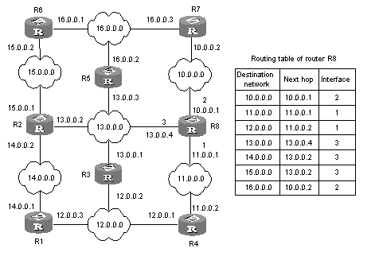

# Lecture 23: Network Services

## Introduction

Today, we will be exploring the fundamental aspects of network services that are pivotal in the domain of cybersecurity.

* Our focus will be on understanding how these services operate, their roles in network infrastructure, and the associated security implications. 

By the end of this lecture, you will be able to list network infrastructure services, describe their roles, and understand their security aspects.

### Domain Name System (DNS)

**Definition and Concepts:**

- **Domain Name System (DNS):** Translates human-readable domain names (like www.example.com) into IP addresses.
- **Functionality:** Acts as the phonebook of the internet, enabling browsers to load internet resources.
- **Security Implications:** 
  - **Benefits:** Provides a user-friendly way to access websites.
  - **Risks:** Susceptible to DNS spoofing and cache poisoning attacks.
- **Example:** Typing "www.google.com" in your browser and accessing Google's server via its IP address.

### Domain Name Server

**Definition and Concepts:**

- **Domain Name Server:** A server that contains a database of public IP addresses and their associated hostnames.
- **Functionality:** Resolves domain names to IP addresses.
- **Security Implications:**
  - **Benefits:** Critical for resolving domain names quickly.
  - **Risks:** Targets for DDoS attacks and can be manipulated in DNS hijacking.
- **Example:** Google's public DNS server (8.8.8.8).

### Directory Services

**Definition and Concepts:**

- **Directory Services:** Stores, organizes, and provides access to information in a directory.
- **Functionality:** Manages user data, including usernames, passwords, and permissions.
- **Security Implications:**
  - **Benefits:** Centralized management of network resources.
  - **Risks:** If compromised, attackers gain extensive access to network resources.
- **Example:** Microsoft's Active Directory.

### Authentication Services

**Definition and Concepts:**

- **Authentication Services:** Verify the identity of users or devices.
- **Functionality:** Ensures that only authorized users can access network resources.
- **Security Implications:
  - **Benefits:** Enhances security by preventing unauthorized access.
  - **Risks:** Vulnerable to brute force attacks and phishing.
- **Example:** Multi-Factor Authentication (MFA).

### DHCP (Dynamic Host Configuration Protocol)

**Definition and Concepts:**

- **DHCP:** Assigns IP addresses to devices on a network automatically.
- **Functionality:** Simplifies the management of IP addresses.
- **Security Implications:**
  - **Benefits:** Reduces configuration errors and network management overhead.
  - **Risks:** Can be exploited by attackers to perform DHCP starvation attacks.
- **Example:** Your home router assigning IP addresses to all your devices.

### DHCP Server

**Definition and Concepts:**

- **DHCP Server:** A server that handles DHCP requests from clients.
- **Functionality:** Allocates IP addresses to devices on the network.
- **Security Implications:**
  - **Benefits:** Centralized management of IP allocation.
  - **Risks:** Can be targeted for DHCP spoofing and starvation attacks.
- **Example:** DHCP server in a corporate network setting.

### Routing

**Definition and Concepts:**

- **Routing:** The process of selecting paths in a network along which to send network traffic.
- **Functionality:** Directs data packets between networks.
- **Security Implications:**
  - **Benefits:** Efficient network traffic management.
  - **Risks:** Prone to routing table poisoning and IP spoofing.
- **Example:** Routers directing traffic between different subnets in a corporate network.

### Routing Tables

**Definition and Concepts:**

- **Routing Tables:** Data tables stored in routers that list the routes to particular network destinations.
- **Functionality:** Guides the router on where to send data packets.
- **Security Implications:
  - **Benefits:** Enables efficient data routing.
  - **Risks:** Can be tampered with to redirect traffic.
- **Example:** A router's routing table directing traffic to the correct subnet.

Figure 1: Routing Table with Destination, Next Hop, and Interface Columns

Reference: 

<https://superuser.com/questions/959242/how-is-next-hop-defined-in-routing-table>

### Remote Access Services

**Definition and Concepts:**

- **Remote Access Services:** Allows users to access a network remotely.
- **Functionality:** Facilitates remote work and access to network resources.
- **Security Implications:**
  - **Benefits:** Increases flexibility and productivity.
  - **Risks:** Exposes the network to potential unauthorized access and attacks.
- **Example:** VPN (Virtual Private Network) services.

### Network Services and Resources

**Definition and Concepts:**

- **Network Services and Resources:** Encompasses various services like file sharing, printing, and email.
- **Functionality:** Provides essential services for daily operations.
- **Security Implications:**
  - **Benefits:** Enhances productivity and collaboration.
  - **Risks:** Each service can be a potential attack vector.
- **Example:** File sharing services in a corporate network.

### File Services

**Definition and Concepts:**

- **File Services:** Manages and provides access to files across a network.
- **Functionality:** Enables users to store, retrieve, and share files.
- **Security Implications:**
  - **Benefits:** Centralized data management.
  - **Risks:** Can be targeted by ransomware and unauthorized access.
- **Example:** Network-attached storage (NAS).

### Print Services

**Definition and Concepts:**

- **Print Services:** Manages and controls printers and printing tasks across a network.
- **Functionality:** Streamlines printing operations.
- **Security Implications:**
  - **Benefits:** Centralized management of print resources.
  - **Risks:** Can be exploited to steal sensitive documents.
- **Example:** Print servers in a corporate environment.

### Web Services

**Definition and Concepts:**

- **Web Services:** Hosts websites and web applications.
- **Functionality:** Provides access to web resources.
- **Security Implications:
  - **Benefits:** Facilitates online presence and services.
  - **Risks:** Vulnerable to web attacks like SQL injection and XSS.
- **Example:** Apache HTTP Server hosting a website.

### Mail Services

**Definition and Concepts:**

- **Mail Services:** Manages email transmission and storage.
- **Functionality:** Provides email communication capabilities.
- **Security Implications:**
  - **Benefits:** Essential for communication.
  - **Risks:** Susceptible to email phishing and spam.
- **Example:** Microsoft Exchange Server.

### Communication Services

**Definition and Concepts:**

- **Communication Services:** Supports various communication tools like VoIP and instant messaging.
- **Functionality:** Enables real-time communication.
- **Security Implications:
  - **Benefits:** Enhances collaboration and connectivity.
  - **Risks:** Can be intercepted or eavesdropped.
- **Example:** Skype for Business.

### Summary Table

| **Topic**                     | **Description**                                                                          | **Benefits**                                                    | **Risks**                                                         |
|-------------------------------|------------------------------------------------------------------------------------------|-----------------------------------------------------------------|-------------------------------------------------------------------|
| **Domain Name System (DNS)**  | Translates domain names into IP addresses                                                | User-friendly access to websites                                | DNS spoofing, cache poisoning                                    |
| **Domain Name Server**        | Contains a database of IP addresses and hostnames                                        | Quick domain name resolution                                    | DDoS attacks, DNS hijacking                                      |
| **Directory Services**        | Manages user data, including usernames, passwords, and permissions                       | Centralized resource management                                 | Extensive access if compromised                                  |
| **Authentication Services**   | Verifies the identity of users or devices                                                | Prevents unauthorized access                                    | Vulnerable to brute force attacks, phishing                      |
| **DHCP**                      | Assigns IP addresses to devices automatically                                            | Simplifies IP management                                        | DHCP starvation attacks                                          |
| **DHCP Server**               | Handles DHCP requests from clients                                                       | Centralized IP allocation                                       | DHCP spoofing, starvation attacks                                |
| **Routing**                   | Selects paths for network traffic                                                        | Efficient traffic management                                    | Routing table poisoning, IP spoofing                             |
| **Routing Tables**            | Lists routes to network destinations                                                     | Efficient data routing                                          | Can be tampered with                                             |
| **Remote Access Services**    | Allows users to access a network remotely                                                | Increases flexibility, productivity                             | Exposes network to unauthorized access                           |
| **Network Services & Resources** | Provides services like file sharing, printing, and email                              | Enhances productivity                                           | Potential attack vectors                                         |
| **File Services**             | Manages and provides access to files across a network                                    | Centralized data management                                     | Targeted by ransomware, unauthorized access                      |
| **Print Services**            | Manages printers and printing tasks                                                      | Centralized print resource management                           | Can be exploited to steal sensitive documents                    |
| **Web Services**              | Hosts websites and web applications                                                      | Facilitates online presence and services                        | Web attacks (SQL injection, XSS)                                 |
| **Mail Services**             | Manages email transmission and storage                                                   | Essential for communication                                     | Email phishing, spam                                             |
| **Communication Services**    | Supports communication tools like VoIP and instant messaging                             | Enhances collaboration and connectivity                         | Can be intercepted or eavesdropped                               |

### Conclusion

Understanding network services is crucial in the field of cybersecurity. These services form the backbone of modern communication and operations, but they also come with inherent risks. As future cybersecurity professionals, it is essential to not only comprehend these services but also be aware of their security implications. This knowledge will empower you to protect and secure network infrastructures effectively.

## References

1. Gale, A. (2024). Lecture 23 Network Services [PowerPoint slides].Retrieved from [URL](https://teams.microsoft.com/)